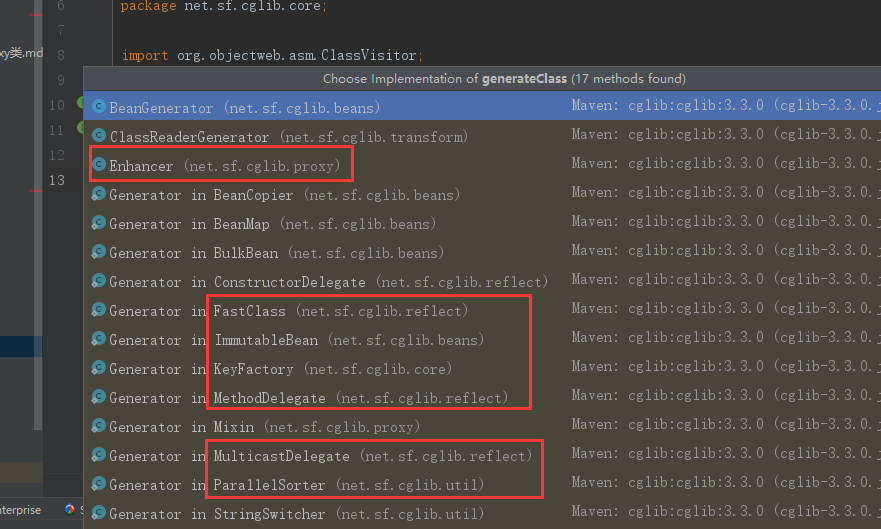

CGlib代码跟读

enhancer.create();
return this.createHelper();
Object result = super.create(key);
data = new AbstractClassGenerator.ClassLoaderData(loader);
Class klass = gen.generate(ClassLoaderData.this);
gen = classLoader.loadClass(this.getClassName());
byte[] b = this.strategy.generate(this);
DefaultGeneratorStrategy.java
public byte[] generate(ClassGenerator cg)
   this.transform(cg).generateClass(cw);
public interface ClassGenerator {
    void generateClass(ClassVisitor var1) throws Exception;
}

然后点击左侧选择具体某个类的生成方式，如：P

CGlib代码跟读
两个顺序
1.主要分析Class对象的生成方式，和byte[]的生成过程
2.主要是分析CGLib的调用方法和JDK的区别，JDK的反射和CGlib实现的动态代理性能上差在哪里了?。FastClass机制到底为啥就比反射快了。

其中性能上

自己写的Proxy类
先拼接java文件
编译成class文件【非常耗时】
再通过反射机制生成对象【较为耗时】
最终实现了动态代理的效果

JDK的Proxy类
JDK的根据class文件的格式，拼接byte[]数组加载生成Class
然后使用反射机制生成对象【较为耗时】
最终实现了动态代理的效果

CGLib的Proxy类
直接使用asm构造出符合class格式的byte[]数组加载生成Class
然后使用FastClass机制生成对象【耗时很小】
最终实现了动态代理的效果

